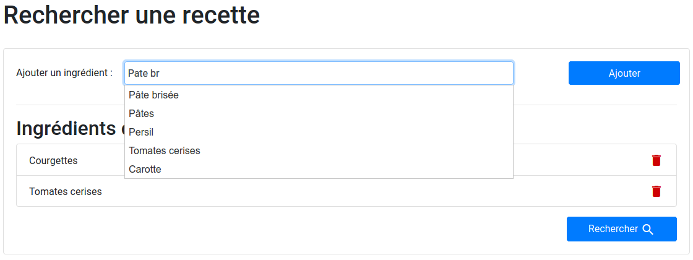
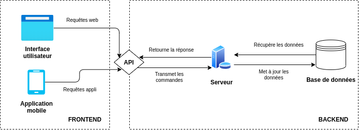
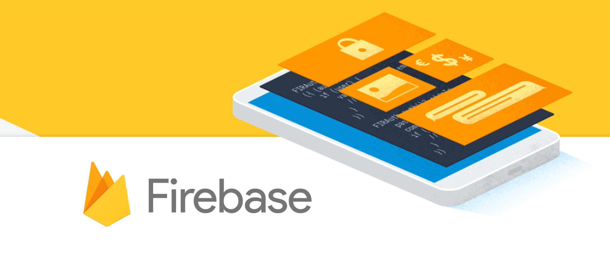

Après avoir réalisé pendant le 1er confinement une application basique en python pour trouver des recettes en fonction des ingrédients présent dans son frigo (le projet est expliqué ici : [a-chef-in-the-fridge](https://nightlyside.github.io/projects/a-chef-in-the-fridge)), je souhaite pousser le concept pour avoir une application complète et fonctionnelle.

Cependant la façon dont je l'ai précédemment conçue ne me plait pas. Bootstrap est trop lourd sans retirer le code inutile (voir [l'élimination de code inutile sur Wikipedia](https://en.wikipedia.org/wiki/Dead_code_elimination)), et la communication entre la base de donnée et l'application n'est pas très sécurisée, d'autant plus que le backend, codé en PHP n'est vraiment pas satisfaisant sur de nombreux points.

## Planification

> Bad programmers worry about the code. Good programmers worry about data structures and their relationship.
> -- _Linus Torvalds_

Un peu à la manière de ces mots, je vais d'abord fixer la structure du projet et les liens entre chacune des parties avant de commencer à coder. Pour cela je vais d'abord devoir fixer des objectifs, ou plutôt des exigences.

### Cahier des charges

L'application peut très vite devenir large et je risque fortement de me perdre dans les fonctionnalités. Avec ma compagne nous avons donc défini des exigences minimales pour sortir un produit viable.

Pour trouver ces exigences on peut commencer par la phrase "_L'application doit_" :

1. permettre à un utilisateur de donner les ingrédients qu'il a et retourner des recettes en conséquence
2. enregistrer et afficher des recettes tirées d'internet ou enregistrées par les utilisateurs
3. être accessible sur un navigateur web (et pourquoi pas une application mobile) à n'importe quel moment

### Structure

Pour répondre à ces exigences il faut penser à la façon dont le projet va s'articuler. Quelles sont les briques nécessaires à la réalisation de ce projet ?

Faisons la liste des élements nécessaires. On va pouvoir ensuite les mettre sur un schéma qui donnera leurs relations respectives.

Il nous faut :

-   Un moyen d'enregistrer des données (pour les recettes et les ingrédients) -> exigence 1
-   Un moyen de traiter les données, d'y accèder, de chercher des recettes à partir d'ingrédients et d'enregistrer des recettes -> exigence 2
-   Une interface utilisateur pour accéder à ces données et les modifier -> exigence 3

Maintenant que ces éléments sont listés, je dessine le schéma :

### Choix des technologies

Je pars avec une bonne idée de ce que je souhaite d'un point de vue technologies.

Pour la base de données j'hésite encore entre une solution sur [Firebase](https://firebase.google.com/) avec le free tier qui semble correct (20k lectures / 10k écritures par jour) ou bien une solution avec SQLite qui tournerait sur le serveur (gratuit pour le coup).

Pour le serveur backend je pense utiliser python avec comme bibliothèque [Flask](https://flask.palletsprojects.com/en/1.1.x/) pour la création d'une CRUD API.

Enfin pour le frontend ou plutôt l'interface utilisateur j'hésitais entre [React](https://fr.reactjs.org/) et [Svelte](https://svelte.dev/), ce dernier étant tout récent et pour l'instant moins populaire, je vais très probablement partir sur une interface réalisée avec React.

Pour l'application mobile, utilisant React, le choix logique est de passer par React Native pour générer des applications android et iOS avec le même code de base et le même framework (React bien évidemment).

## Conclusion

Cette courte introduction est le point de départ vers ce nouveau projet. Je posterais de nouveaux articles au fur et à mesure de mon avancée sur ce projet.

Mon objectif est de voir toutes les facettes du développement logiciel et ce, en utilisant des technologies modernes tout en pensant à la **performance** et à **l'accessibilité**.
