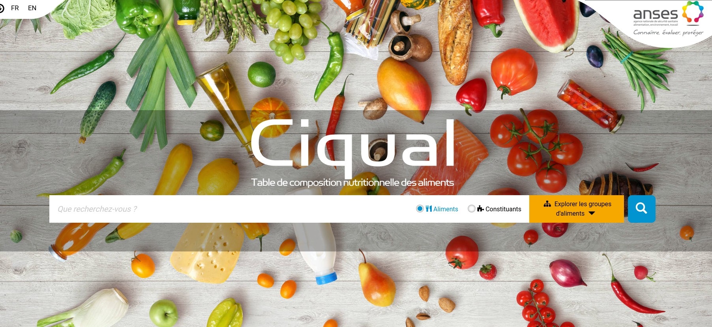
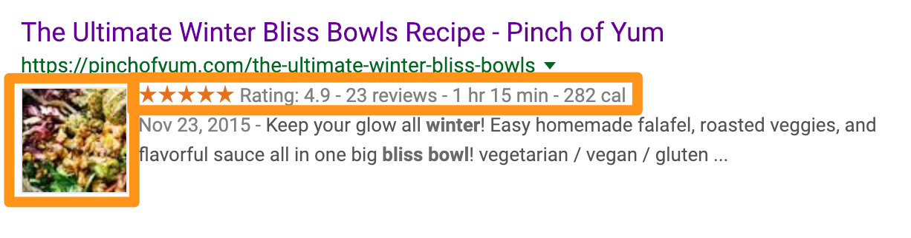

Le projet a été planifié dans l'article précédent. Je vais maintenant me concentrer sur la base de données ainsi que les objets que je vais stocker dans cette base de données.

## Choix de la technologie

Quand il s'agit de choisir une technologie pour les bases de données, on est confronté à un très large choix. Que ce soit pour des structures "classiques" comme MySQL, ou des technologies plus modernes se basant sur du NoSQL comme Firebase avec leur système de collection, il devient difficile de faire un choix.

Mon application sera relativement simple d'un point de vu données. Stocker la base de données sur la même machine que le serveur ne me pose pas de problème, ce qui ouvre encore plus mon choix des possibles 😅.

Dans l'introduction j'expliquais hésiter entre [Firebase](https://firebase.google.com/) et [SQLite](https://sqlite.org/index.html). Cependant plusieurs arguments me font pencher vers SQLite comme le fait que j'hébergerais en local cette solution (donc gratuit 🤑) et le fait d'avoir un fichier physique pour la base de donnée me permettra de faire des sauvegardes plus facilement.

**Je vais implémenter une base de données SQLite en fichier local sur la même machine que le serveur de backend.**

## Types des données

S'agissant d'une application pour chercher et afficher des recettes à partir d'ingrédient, cela sera les deux premiers objets à créer.

### Les ingrédients

Dans ma précédente itération de l'application, l'ingrédient était une structure d'objet complexe. On devait y définir son nom et aussi ses caractéristiques (lipide, glucide, etc...) je souhaitais ainsi pouvoir donner des informations nutritionnelles sur les plats ajoutés.

Cependant j'ai découvert il y a peu les jeux de données disponibles publiquement sur le site du gouvernement français : [https://www.data.gouv.fr/fr/](https://www.data.gouv.fr/fr/). Ainsi je pense pouvoir récupérer les qualités nutritionnelles des ingrédients présents dans [Ciqual](https://ciqual.anses.fr/), en téléchargeant le jeu de données sur le site [data.gouv.fr](https://www.data.gouv.fr/fr/datasets/table-de-composition-nutritionnelle-des-aliments-ciqual/).

L'utilisateur n'aura plus à rentrer manuellement les informations, elles seront récupérées automatiquement depuis les informations enregistrée dans la table de données.

L'ingrédient devra alors contenir les informations suivantes :

-   `id` : pour identifier l'ingrédient dans la base de données
-   `nom` : le nom de l'ingrédient
-   `proteine` : les proteines pour 100g
-   `glucides` : les glucides pour 100g
-   `lipides` : les lipides pour 100g
-   `energie` : l'énergie en kcal pour 100g

### Les recettes

Voila le coeur de fonctionnement de l'application : les recettes. Dans l'ancienne itération les recettes étaient malheureusement entrées à la main à partir des ingrédients qui étaient déjà présent dans la base de données.

C'est une méthode à la fois très longue, trop peu flexible et simplement pas très agréable à utiliser.

Dans cette itération l'utilisateur pourra importer une recette depuis un site supportant les [métadonnées de recette](https://developers.google.com/search/docs/data-types/recipe#recipe-properties) comme marmiton pour n'en citer qu'un.

Une autre façon sera pour l'utilisateur de rentrer sa recette en l'écrivant comme dans un document word. L'application se chargera de faire la traduction en données.

Aussi je souhaite que seul le propriétaire de la recette puisse la modifier, il me faut donc stocker cette information.

Les recettes devront contenir les informations suivantes :

-   `id` : pour identifier la recette dans la base de donnée
-   `thumbnail` : lien vers l'image illustrant la recette
-   `ingredients` : tableau d'ingrédients constituant la recette
-   `etapes` : etapes de réalisation de la recette
-   `t_preparation` : temps de préparation de la recette
-   `t_cuisson` : temps de cuisson de la recette
-   `source` : url du site d'où provient la recette ou alors le nom de la personne ayant entré la recette
-   `author_id` : identifiant du propriétaire de la recette

### Les utilisateurs

Je souhaite que cette fois-ci les utilisateurs puissent s'enregistrer et sauvegarder des recettes qui leur plaisent dans leur propre livre de recette.

Pour cela je vais avoir besoin d'un table réservée aux utilisateurs avec leurs informations (limitées bien sur 😝) ainsi qu'une liste d'identifiants qui correspondra à leur livre de recette.

Les utilisateurs devront contenir les informations suivantes :

-   `id` : pour identifier l'utilisateur dans la base de données
-   `username` : nom d'utilisateur pour se connecter
-   `email` : adresse email de l'utilisateur
-   `passowrd` : hash du mot de passe probablement en SHA1 ou BCrypt
-   `role` : rôle de l'utilisateur sur la plateforme (USER ou ADMIN)
-   `cookbook` : liste d'identifiants de recettes contenues dans le livre de recette (favoris) de l'utilisateur

## Conclusion

L'étape de recherche pour la base de données est cruciale. Elle m'a permit entre autres de chercher des solutions aux problèmes que je n'ai pas su résoudre dans la première itération, notamment pour les qualité nutritionnelles des ingrédients.

J'en ai aussi profité pour découvrir tout un tas de jeux de données sur [data.gouv.fr](https://www.data.gouv.fr/fr/) qui seront bien utiles pour les futurs projets.

La prochaine étape sera d'expérimenter ces différentes API avant de les assembler en un serveur de backend.
