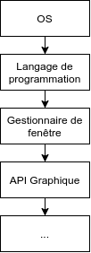
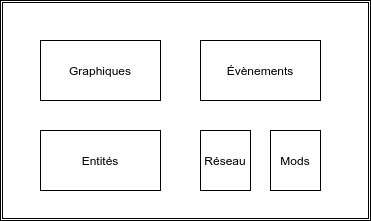

Développement son propre moteur de jeu en 3d est un très bon exercice pour comprendre comment fonctionnent les graphismes
3d sur son ordinateur. Nous allons voir comment créer notre propre moteur de rendu pour afficher des Voxels et le tout
en rust !

> 🚀 Cet article est écrit suite à mes recherches sur le sujet qui ont conduit à la création de mon moteur : ROVER engine
> disponible en open-source sur github ici: [ROVER-engine](https://github.com/NightlySide/ROVER-engine)

## Les technologies

Pour être le plus clair possible je vous propose ce schéma pour expliquer les différentes briques nécessaires à la
réalisation de ce projet.



### Langage de programmation

Commençons par le langage. La plupart des moteurs maison sont codés en C++ cependant je voulais me tourner vers un
nouveau langage que je considère d'avenir: le [Rust](https://www.rust-lang.org/fr).

</img>

Pour résumer en quelques mots, Rust est un langage de programmation de bas niveau qui place la sécurité mémoire au coeur
de sa conception. Ainsi les fuites ou corruption de mémoire sont quasiment impossible, le compilateur tenant le
développeur presque par la main.

### Gestionnaire de fenêtres

Ce choix est dépendant du langage de programmation choisi. Pour rust, le choix évident est [winit](https://github.com/rust-windowing/winit).

Cette bibliothèque permet de gérer de façon cross-platform la création ainsi que la gestion des fenêtres à bas niveau.

Voici par exemple le code permettant d'ouvrir une fenêtre et de la fermer en cliquant sur la croix en haut de cette
dernière:

```rust
let event_loop = EventLoop::new();
let window = WindowBuilder::new().build(&event_loop).unwrap();

event_loop.run(move |event, _, control_flow| {
    *control_flow = ControlFlow::Wait;

    match event {
        Event::WindowEvent {
            event: WindowEvent::CloseRequested,
            window_id,
        } if window_id == window.id() => *control_flow = ControlFlow::Exit,
        _ => (),
    }
});
```

Mais nous y reviendrons plus en détails dans les prochains articles 😉

### API Graphique

Vous avez sûrement déjà entendu parler de DirectX, nécessaire pour faire fonctionner la plupart des jeux sous windows.
Eh bien DirectX est une API graphique, c'est à dire une couche d'abstraction permettant de gérer certains concepts
de très bas niveau avec le GPU.

Les trois API Graphiques les plus populaires et répandues sont :

-   **OpenGL**: cross-platform mais une syntaxe qui se fait vieille
-   **DirectX**: une API uniquement disponible sous windows mais moderne
-   **Vulkan**: une API moderne cross-platform mais de bien plus bas niveau que les autres

Pour ce projet j'ai décidé de monter d'un cran niveau abstraction, j'ai donc choisi comme API Graphique [wgpu](https://github.com/gfx-rs/wgpu-rs)
ou encore appelé WebGPU.

</img>

Cette API possède plusieurs avantages non négligeables. Tout d'abord elle est cross-platform
mais surtout sa syntaxe est indépendante des autres API. Nous pouvons alors changer d'API à la volée ou produire
plusieurs binaires fonctionnant avec d'autres API. Enfin ... elle est aussi écrite en Rust 🦀

## Le moteur

Qu'est-ce qui va composer notre moteur de jeu ? Cette section risque de changer au fur et à mesure de l'avancée de mes
recherches dans ce sujet.

Voici les pistes que j'ai trouvé et qui m'intéressent beaucoup. Encore une fois je commence par un schéma global du
projet afin d'être clair sur les directions que je prends.



### Brique Graphique

On a déjà parlé des quelques technologies qui constitueront cette brique. Je souhaite créer un moteur de jeu en Voxels
(des pixels à 3 dimensions) dont une bonne partie du rendu graphique serait abstrait.

Pour cela il faudra que l'on puisse créer des pipelines de rendu, des shaders et des optimisations sur les maillages
que l'on va obtenir dans ce projet.

> Cette partie est celle qui me retourne actuellement la tête 🤯. Ayant une formation en cybersécurité et non
> en design ou rendu 3d, je m'autoforme sur le sujet depuis une quinzaine de jours. Le contenu qui suit sera donc
> susceptible de changer avec ~~mon humeur~~ mes nouvelles découvertes

C'est promis je vais en parler plus en détail dans le prochain post !

### Brique évènements

Une fois le rendu correct, il faudra regarder comment propager différents évènements dans l'ensemble du code.

Prenons l'exemple d'un jour appuyant sur le bouton droit de sa souris. Est-ce que cela lui permet de viser ?
D'interagir avec une entité ?

Dans ce cas le moteur devra générer un évènement qui sera ensuite "consommé" par un composant du projet.

### Brique entités

Cette brique représentera la suite logique du processus de création. On s'occupe d'abord de créer un terrain, puis
les entités qui y vivent et les interactions dans ce beau petit monde.

Pour profiter du parallélisme des processeurs actuels, je pense m'orienter pour cette brique sur le concept de [système
entités composants](https://guillaume.belz.free.fr/doku.php?id=ecs) (ECS).

En passant pas la composition, on ne cherche plus une fonctionnalité dans une entité (comme la vie chez un personnage)
mais plutôt les entités possédants le composant en question. Ainsi les possibilités de filtrage sont plus importante
et les performances sont meilleures.

### Briques réseau et mods

Ces briques sont bonus. Elles ne sont pas nécessaire pour obtenir un premier [produit minimum viable](https://fr.wikipedia.org/wiki/Produit_minimum_viable) (MVP).

Il serait intéressant de voir comment fonctionne à bas niveau la gestion client-serveur avec de la prédiction par exemple
et de l'interpolation pour une expérience utilisateur fluide.

Concernant les mods, il serait bien de pouvoir ajouter des fonctionnalités au moteur sans avoir à toucher au code source
de ce dernier, de proposer des fonctionnalités sur la base de "plugins" que le développeur pourrait ajouter ou retirer.

## Conclusion

Je pense honnêtement que beaucoup d'articles vont suivre ce post. En effet le monde du rendu 3d est très vaste et en
pleine révolution ! Il y aura malheureusement beaucoup trop de choses à dire pour que tout puisse tenir sur un seul
article.

J'espère que vous découvrirez le monde du rendu 3d et que vous allez apprécier vous tordre les méninges (comme je l'ai
apprécié 😄) sur la manière de mettre en place tous ces concepts.

À l'heure où j'écris ces lignes voici un aperçu du moteur que j'ai réussi à concevoir :

<video controls width="100%">
  <source src="https://i.imgur.com/Xagh4Ul.mp4" type="video/mp4">
</video>
