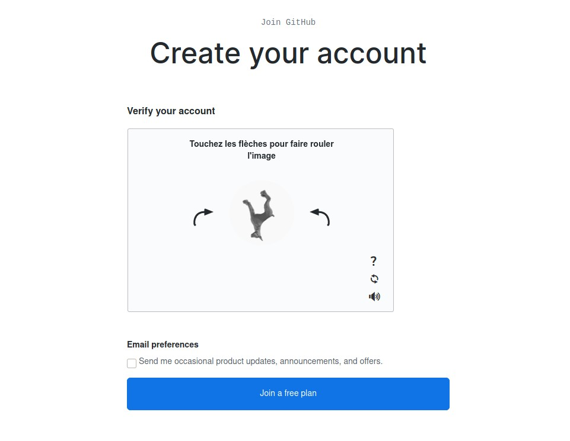

[Github](https://github.com/) est devenu très rapidement la référence en logiciel de gestion de développement. Aujourd'hui les projets open-source sont très nombreux sur la plateforme et de plus en plus d'entreprises demande aux candidats de leur fournir en plus de leur CV, leur compte Github afin de voir les projets du candidat ainsi que ses contributions au monde open-source.

## Créer un compte sur github

Tout d'abord, il faut savoir que Github est gratuit. La fonctionnalité "Pro" ajoute certes quelques éléments intéressants mais qui ne sont pas utiles au jeune développeur.

> Si vous êtes étudiant vous pouvez obtenir un compte pro en passant par [le pack éducation](https://education.github.com/)

Pour créer un compte il suffit d'aller sur le site [https://github.com/](https://github.com/) et de renseigner les champs suivants.

## Valider le compte

Comme la plateforme est sérieuse et que le contenu publié est important pour les développeurs, il est nécessaire d'activer son compte avant de pouvoir continuer.
Il s'agit donc de résoudre un petit puzzle pour valider le compte (surtout que vous n'êtes pas un robot).

Enfin, cliquez sur _join a free plan_.

> N'oubliez pas de regarder vos mails pour activer votre compte.

## Quelques infos sur votre profil

Pour pouvoir remplir un profil de base, l'étape suivante est de donner quelques détails sur votre formation de programmeur.
Entre autres : le type de travail, l'expérience en programmation et l'utilisation prévue de Github.

Personnellement étant un étudiant avec de l’expérience en programmation je coche :

- Student : I go to school
- A lot : I'm very experienced
- Host a project (repository), Create a website with GitHub Pages, School work and student projects

Enfin dans mes intérêts j'indique comme langage (pour ma part) python, html, php, javascript.

Cliquez sur _Complete Setup_.

## Les prochaines étapes

Maintenant que vous avez un compte Github, voici quelques étapes que vous pouvez faire :

- Créer un repository et commencer un projet
- Collaborer sur un projet en commun
- Changer votre nom et votre avatar
- [Héberger un site web avec GitHub Pages](/eportfolio/2020-07-01-creer-un-site-github-pages.md)
