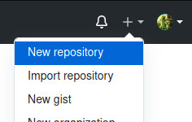
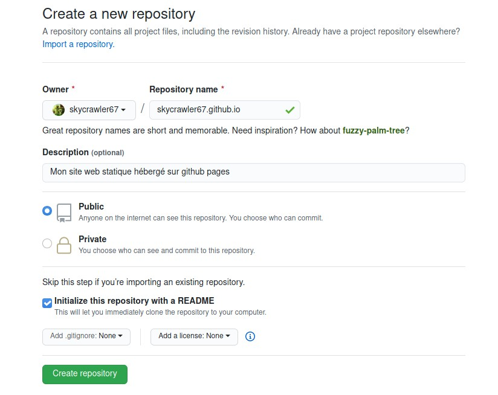
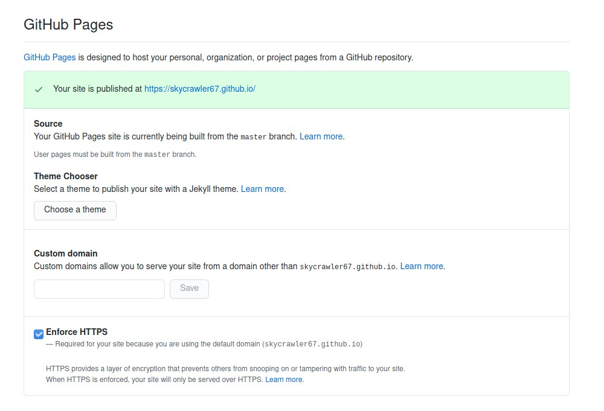

Avoir un site web à son nom est non seulement un gros plus dans le monde du numérique, mais il peut même être nécessaire pour décrocher certains emplois.
Grâce à GitHub Pages il est facile de créer un site statique et de l'héberger sur leurs serveurs, c'est ce que nous allons voir dans cet article.

> Cet article suppose que vous avez déjà un compte GitHub.
> Si ce n'est pas le cas vous pouvez lire mon article sur [comment créer un compte github](/eportfolio/2020-06-29-creer-compte-github.md)

## Créer le repository

La première étape consiste à créer le repository, le projet, qui contiendra les fichiers sur site.
Pour cela il suffit de cliquer sur le "plus" en haut à droite et de choisir _New repository_.

**Attention** le choix du nom est important ! Pour pouvoir profiter de github pages, le repository doit avoir un nom de la forme : 

<code>(nom utilisateur).github.io`</code>

> Exemple : mon pseudo pour ces articles sur Github est _skycrawler67_, le repository doit alors se nommer `skycrawler67.github.io`.

Il faudra bien penser à mettre le repository en publique et pour nous simplifier la vie on va l'initialiser avec un README.
Enfin, cliquez sur le bouton _Create Repository_ pour créer le repository.

## Activer l'hébergement par Github Pages

Une fois les étapes précédentes réalisées vous devriez arriver sur la page principale de votre repository, vous montrant le contenu du fichier README ainsi que les fichiers présents dans ce projet.

Pour activer l'hébergement sur Github Pages il faut aller dans les paramètres (cliquez sur l'engrenage) puis descendez jusqu'à la section "Github Pages". Si toutes les étapes précédentes ont été suivies, le site nous explique que le site est bien publié à l'adresse correspondant au nom du repository.

Si ce n'est pas le cas il vous faudra spécifier la branche que Github devra suivre pour la publication. La branch _master_ (ou plus récemment *main*) est la plus communément utilisée, il s'agit de la branche principale.

> Exemple : en suivant ce que j'ai écrit, mon site est alors publié sur [https://skycrawler67.github.io/](https://skycrawler67.github.io/).

## Conclusion

Pour vérifier que le site est bien en ligne il suffit de suivre le lien. Si tout s'est bien passé le lien affiche le contenu du fichier _README.md_. Il ne reste alors plus qu'à créer le site et l'envoyer sur ce repository pour qu'il soit publié sur la page.

Pour aller plus loin :

- Créer un site web statique avec Jekyll/Hugo/Pelican (recommandé)
- Créer une landing page (page d'accueil) en HTML/CSS/JS avec par exemple [Bootstrap](https://getbootstrap.com/)
- Rédiger des articles, des postes, mettre son CV en ligne etc...

> Ce site à été uploadé sur GitHub Pages, je vous expliquerai dans un prochain article comment reproduire ce que j'ai fait
