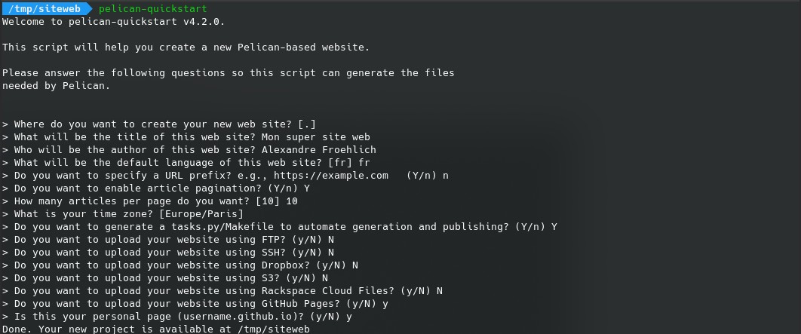
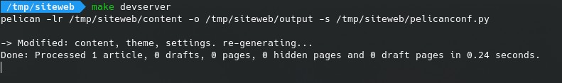
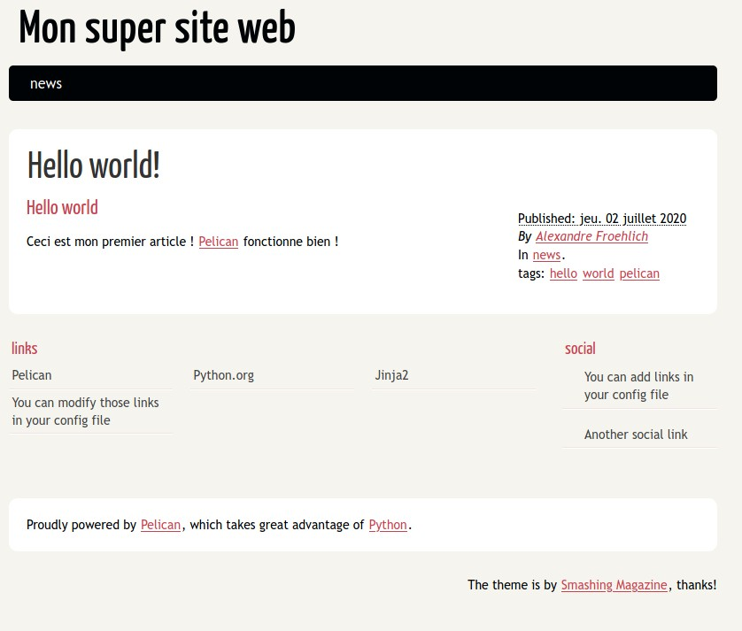

Je l'ai déjà écrit mais avoir un site web pour se mettre en avant est nécessaire aujourd'hui. Les générateurs de contenu statique représentant le futur du web, nous allons voir comment concevoir un site web statique avec [Pelican](https://docs.getpelican.com), un module pour python et l'intégrer dans GitHub Pages.

## Introduction

Pour créer un site web il existe pleins de moyens différents. Pour les novices, des services graphiques sont proposés pour concevoir des sites web en 1 pages, pour les plus curieux il existe des [CMS](https://fr.wikipedia.org/wiki/Syst%C3%A8me_de_gestion_de_contenu) (Content Management System) qui permettent de de rédiger des articles et de gérer le contenu. Cependant cette dernière solution est souvent lourde (ex: Wordpress) et peut potentiellement présenter des failles.

Un nouveau système est cependant en train de monter en puissance : les générateurs de contenus statiques. [Pelican](https://docs.getpelican.com/en/stable/) est l'un d'entre eux. On pourrait aussi citer par exemple [Hugo](https://gohugo.io/) (en Go) et [Jekyll](https://jekyllrb.com/) (en Ruby). Pour cet article je vais me concentrer sur Pelican.

## Qu'est-ce que Pelican ?

« _Pelican est un générateur de site statique, écrit en Python_ »

Pour ceux qui ne savent pas ce qu'est un générateur de site statique voici le fonctionnement simplifié de la rédaction d'un article :

- Le contenu de l'article est rédigé en [Markdown](https://fr.wikipedia.org/wiki/Markdown)
- Pelican récupère ces fichiers et les transforme en page web en se basant sur des templates
- Le site web complet est disponible dans le dossier _output_

Une fois les templates conçut, il est alors très simple de rajouter un article ou une page sur le site ! C'est la toute la puissance de ces générateurs : le contenu est compilé et statique donc l'accès au site est très rapide et il n'y a pas de failles car le code source du site (les fichiers markdown et la configuration) ne sont pas directement accessibles.

Aussi est-ce que je vous ai parlé des plugins ? Pelican peut être amélioré en fonctions grâce aux plugins [disponibles ici](https://github.com/getpelican/pelican-plugins) (vous même pouvez créer un plugin assez facilement)

## Création du projet

Tout d'abord il faut installer Pelican. Je suppose que vous avez déjà python 3 installé sur votre machine avec _pip_. Pour installer Pelican il suffit de lancer la commande (avec support pour les fichiers Markdown):

```bash
pip install pelican[Markdown]
```

Ensuite créer un dossier qui contiendra votre site web et entrez dedans.
On va maintenant créer le squelette du site à l'aide de la commande `pelican-quickstart`.



Renseignez tous les champs demandé. Pour information ce qui est renseigné entre les crochets est la valeur par défaut si vous n'entrez rien.
**Attention :** n'oubliez pas de dire oui à la question sur Github Pages en précisant qu'il s'agit de votre page personnelle. N'oubliez pas de dire oui à la création d'un fichier _Makefile_. Ces parties vont nous simplifier le travail par la suite.

Vous devriez vous retrouver avec les fichiers suivants :

- _Makefile_ : fichier permettant de compiler le site web
- _content_ : le dossier qui contient les fichiers source
- _output_ : le dossier qui contient le site web compilé
- _pelicanconf.py_ : fichier de configuration de base de Pelican (on va revenir dessus)
- _publishconf.py_ : fichier de configuration lors de la compilation pour la publication (ex: avec l'URL de Github pages)
- _tasks.py_ : fichier des tâches pour publier sur Github Pages (on y touche pas du tout)

## Écrire un article

Les fichiers de base sont bien crées et pour l'instant la configuration de base est suffisante pour commencer à rédiger des articles. On s'occupera de la publication dans la section d'après.

Pour le premier article il faut créer un fichier. Pour la nomenclature des noms j'aime bien créer un dossier par catégorie puis préciser chaque ficher sous la forme suivante : `année-mois-jour-titre-de-l-article.md`.

Pour cet exemple je vais créer dans un dossier `news` l'article `2020-07-02-hello-world.md` avec le contenu suivant :

```YAML
---
title:      Hello world!
date:       07-02-2020
category:   news
tags:       hello,world,pelican
status:     published
---

## Hello world

Ceci est mon premier article ! [Pelican](https://docs.getpelican.com/en/stable/) fonctionne bien !
```

Entre les tirets on a ce qu'on appelle les méta-données de l'article. C'est la partie description technique de l'article. On y retrouve le titre qui sera affiché, la date, la catégorie et le statut de publication par exemple. En dessous on a le contenu de l'article au format markdown.

Il ne reste plus qu'à compiler. Pour cela il suffit de faire :

```bash
make devserver
```



Puis d'aller sur l'adresse : [http://localhost:8000](http://localhost:8000) pour visualiser le résultat. Si aucune erreur ne s'affiche vous devriez avoir le résultat suivant avec votre article :



Félicitations ! vous avez à présent un site web fonctionnel et qui se génère à partir de fichiers écrits en markdown.

## Déployer sur Github Pages

La première étape est d'éditer la configuration du fichier `publishconf.py` afin de changer la ligne suivante :

```python
SITEURL = 'https://skycrawler67.github.io'
```

> L'adresse du site est celle fournie par Github Pages : voir l'article [comment héberger un site avec GitHub Pages]({filename}/eportfolio/2020-07-01-creer-un-site-github-pages.md)

Il faut bien penser à préciser le https ici car Github Pages est réglé par défaut avec le protocole sécurisé.

Ensuite on recompile pour vérifier que tout fonctionne correctement mais cette fois-ci avec la configuration de publication :

```bash
make publish
```

Enfin pour déployer votre site vous pouvez soit utiliser la commande `make github` qui automatise tout si vous avez bien paramétré votre projet.

L'autre solution plus facile est de copier le contenu du dossier _output_ et de le coller dans le dossier correspondant à votre repository.

C'est tout ! Attendez quelques secondes et votre site est alors correctement déployé sur Github Pages !

## Conclusion

Vous avez maintenant toutes les cartes en main pour créer votre propre site en y rédigeant son contenu.

Si vous souhaitez aller plus loin voici quelques pistes :

- Créer un thème pour pélican (celui par défaut n'est pas très personnel)
- Écrire des articles
- Ajouter des plugins à Pelican
- Ajouter un section de commentaires avec [Disqus](https://disqus.com/)
