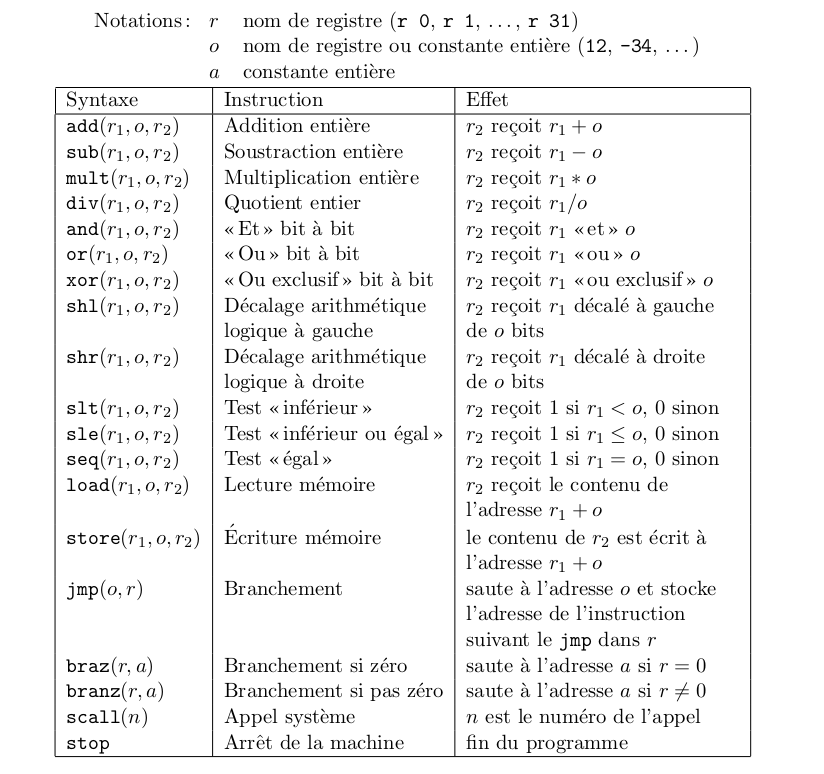
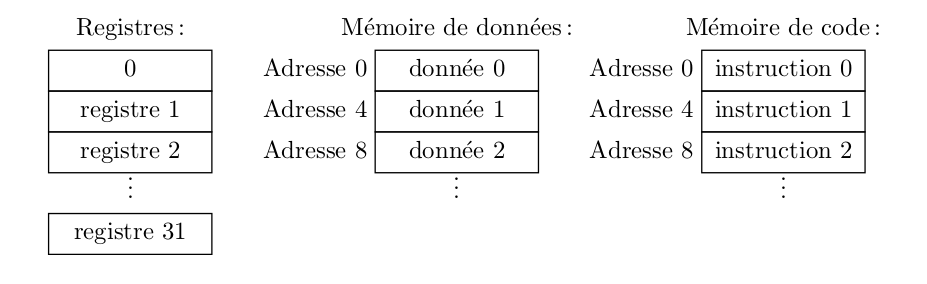
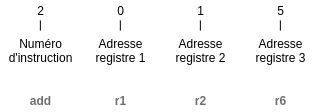
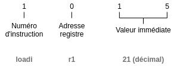

Nous allons voir comment construire une machine virtuelle capable d'interpréter des instructions et de modifier les valeurs des registres en conséquence.

> Cet article a vu le jour suite au cours sur les architectures numériques de l'[ENSTA Bretagne](https://www.ensta-bretagne.fr/fr) et grâce à l'article très complet (en Anglais) "[VM in C](https://en.wikibooks.org/wiki/Creating_a_Virtual_Machine/Register_VM_in_C)"

## Conception du programme

### Choix d'un jeu d'instructions

Nous allons commencer par le programme puisque c'est ce que l'on souhaite exécuter après tout.

Pour le jeu d'instructions j'ai choisi d'implémenter une partie du jeu d'instructions MISC ([Minimal Instruction Set Computer](https://fr.wikipedia.org/wiki/Minimal_instruction_set_computer)) :



Ce choix est motivé par le fait que ce jeu minimaliste reste le plus simple à implémenter (peu d'instructions égal moins de travail pour avoir un [MVP](https://fr.wikipedia.org/wiki/Produit_minimum_viable))

### Adresses de registre

Tout registre et toute variable en mémoire possède une adresse. Pour la machine virtuelle on va devoir décider d'une façon de gérer cet espace mémoire.



On va commencer par quelque chose de simple et placer les register dans un tableau. Ainsi l'adresse du registre sera son index dans le tableau des registres. Cela est amplement suffisant pour un simulateur, mais devra être repensé pour une architecture embarquée.

### Structure d'une instruction

**Comment écrire une instruction ?**

On verra plus tard que pour traduire du texte vers un code que la machine pourra interpréter on devra passer par un lexer et un parser (ce qui sort du domaine de cet article).

Pour l'instant voici à quoi va ressembler une instruction, les données étant en hexadécimal :



L'exemple précédent permet d'additionner les valeurs contenues dans les registres 2 et 5 et d'assigner la valeur au registre 1 : `0x2015`. Cet exemple est équivalent pour toutes les instructions à 3 arguments.

**Comment écrire une instruction à seulement 2 arguments ?**

On garde la même structure de données sauf que cette fois-ci on prend les 2 derniers caractères que l'on considère être 1 seul argument :



Ce qui correspond à l'assignation d'un entier à un registre : `0x1015`.

Il ne reste plus qu'à coder la machine virtuelle maintenant que l'on connaît la structure des instructions !

## La machine virtuelle

N'importe quel langage de programmation peut être utilisé pour programmer la machine virtuelle qui nous servira de simulation. On a peut être plus intérêt à prendre un langage compilé pour optimiser les performances de la simulation. J'ai choisi python pour voir la différence avec l'article cité plus haut.

Python étant un langage orienté objet, ma machine virtuelle sera donc un objet. On commence alors par créer la classe :

```python
class VM:
    def __init__(self, num_reg=4):
        # initialisation de tous les registres
        self.reg = [0 for _ in range(num_reg)]
        # compteur du programme
        # pour savoir quelle instruction appeler
        self.pc = 0
        # le programme à exécuter
        self.prog = None
        # les argumens d'instruction
        self.reg1 = self.reg2 = self.reg3 = self.imm = None
        # Variable d'exécution
        self.running = False
```

Maintenant on peut coder chacune des étapes de la simulation comme étant des méthodes de la classe `VM`.

On commence par la récupération de la prochaine instruction à exécuter :

```python
def fetch(self):
    instruction = self.prog[self.pc]
    # on incrémente le compteur
    self.pc += 1
    return instruction
```

Ensuite on va décoder l'instruction pour récupérer les arguments de la même manière que vu dans le point précédent :

```python
def decode(self, instr):
    instrNum  = (instr & 0xF000) >> 12
    self.reg1 = (instr & 0xF00 ) >>  8;
    self.reg2 = (instr & 0xF0  ) >>  4;
    self.reg3 = (instr & 0xF   )
    self.imm  = (instr & 0xFF  )
    return instrNum
```

Ce qu'on vient de faire est assez simple mais peut paraître un peu compliqué à comprendre à cause des opérations binaires effectuées sur l'instruction.

La première étape est d'appliquer un masque sur l'instruction de manière à ne récupérer que les bits correspondant à l'argument que l'on souhaite. Le masque va ainsi mettre à 0 tous les autres bits.

La seconde étape est de procéder à un décalage pour retirer les zéros en trop. Et c'est tout !

Prenons un exemple :

```python
# Nombre initial
2015
# On applique le masque
2015 & 0xF000 = 2000
# On décale pour récupérer le numéro
2000 >> 12 = 2
# On a ainsi récupéré le numéro d'instruction
(2015 & 0xF000) >> 12 = 2
# Idem pour l'adresse de registre 1
(2015 & 0xF00) >> 8 = 2
```

> 📝 **A retenir** : Un masque est une opération binaire en tout ou rien. En hexadécimal les valeurs vont de `0` à `F`. Ainsi si on souhaite conserver un bit on met `F` sur le masque sinon `0`.

On évalue maintenant l'instruction et les arguments :

```python
def eval(self, instrNum):
    if (instrNum == 0):
        print("halt")
        self.running = False
    elif (instrNum == 1):
        print(f"loadi r{self.reg1} #{self.imm}")
        self.regs[self.reg1] = self.imm
    elif (instrNum == 2):
        print(f"add r{self.reg1} r{self.reg2} r{self.reg3}")
        self.regs[self.reg1] = self.regs[self.reg2] + self.regs[self.reg3]
    elif (instrNum == 3):
        print(f"sub r{self.reg1} r{self.reg2} r{self.reg3}")
        self.regs[self.reg1] = self.regs[self.reg2] - self.regs[self.reg3]
    elif (instrNum == 4):
        print(f"mult r{self.reg1} r{self.reg2} r{self.reg3}")
        self.regs[self.reg1] = self.regs[self.reg2] * self.regs[self.reg3]
```

On voit ici que le numéro d'instruction `0` permet de sortir du programme en mettant la variable `running` sur False. Les autres opérations sont élémentaires, je ne les commenterais pas.

Enfin il ne reste plus qu'à écrire la boucle permettant d'exécuter un programme :

```python
def run(self, prog):
    self.prog = prog
    self.running = True
    while self.running:
        instruction = self.fetch()
        instrNum = self.decode(instruction)
        self.eval(instrNum)
```

## Conclusion

Et c'est tout pour la machine virtuelle ! Il ne reste plus qu'à écrire un programme et à le lancer.. c'est terminé !

```python
prog = [0x1064, 0x11C8, 0x12FA, 0x2301, 0x3132, 0x2201, 0x0000]
vm = VM(num_reg=4)
vm.run(prog)
```

Donne la sortie suivante :

```
loadi r0 #100
regs = 0064 0000 0000 0000
loadi r1 #200
regs = 0064 00c8 0000 0000
loadi r2 #250
regs = 0064 00c8 00fa 0000
add r3 r0 r1
regs = 0064 00c8 00fa 012c
sub r1 r3 r2
regs = 0064 0032 00fa 012c
add r2 r0 r1
regs = 0064 0032 0096 012c
halt
regs = 0064 0032 0096 012c
```

On a un simulateur fonctionnel qui est capable de comprendre des instructions depuis un jeu d'instructions simples et d'agir en conséquences.

Plus tard nous verrons comment améliorer cette machine virtuelle pour lui implémenter de nouvelles fonctionnalités notamment les sauts afin de pouvoir implémenter des fonctions.

> 🐍 Le code source est disponible ici : [iss.py](../../assets/posts/python/iss.py)
