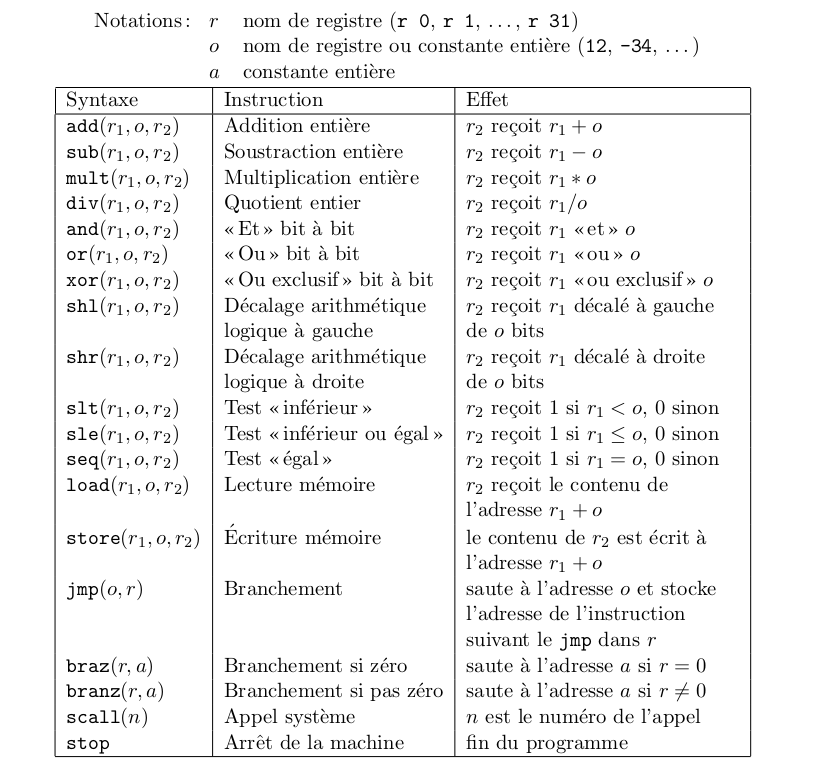

Nous allons maintenant améliorer la machine virtuelle que l'on a conçut dans l'article précédent et ajoutant des fonctionnalités et en redéfinissant les objectifs attendus.

> Pour suivre cet article je vous recommande vivement mon premier article "[Machine virtuelle en Python](https://nightlyside.github.io/posts/python/2021-01-13-vm-in-python)" qui explique comment concevoir une machine virtuelle en python.

## Cahier des charges

Pour pouvoir redéfinir nos objectifs proprement il est important de fixer quelques exigences puis d'y répondre par le code une à une.

Le but est à la fin d'avoir une instruction qui tient sur 32 bits (soit 8 bits en hexadécimal) afin de respecter différentes conventions en place dans les architectures processeur (32 bits).

### Les instructions

Commençons par les instructions. Pour rappel ou souhaite implémenter le jeu d'instructions MISC ([Minimal Instruction Set Computer](https://fr.wikipedia.org/wiki/Minimal_instruction_set_computer)) :



Au total nous avons **19 instructions**. Si on souhaite attribuer un numéro par instruction il nous faudra donc des numéros allant de 0 à 18.

Nos instructions étant codées en héxadécimal, il nous faudra **2 bits** en hexadécimal pour représenter les 19 possibilités. (il nous restera alors $2^16 = 256 - 19 = 237$ instructions disponibles.)

### Les arguments

On a vu dans le jeu d'instruction que les instructions pouvaient prendre 0 (_stop_) à 3 (_add_, ...) arguments.

On remarque dans le jeu d'instructions que les arguments peuvent être des registres ou bien des constantes. Cependant on ne peut avoir qu'une seule constante par opération :

```
Par exemple je souhaite faire a = 2+3.
On fera :
b = 2
a = b + 3
```

On a déjà 2 bits sur les 8 qui sont pris pour le numéro d'instruction. Il nous en reste donc 6.

Si on a 3 arguments on aura 2 bits par argument. Or $16^2 = 256$ possibilités donc on pourra avoir au plus 256 registres. Et surtout on pourra additionner le contenu d'un registre avec un constante faisant au plus 255.

Si on a 2 arguments (par exemple pour charger une constante dans un registre) on aura alors $16^2 = 256$ possibilités pour le registre mais $16^4 = 65536$ possibilités pour la constante ! C'est déjà mieux.

### Les registres

Continuons avec les registres. On peut se poser la question suivante : quelle est la taille maximale d'un objet ?

Elle est directement conditionnée par les arguments et le nombre de bits disponibles dans l'instruction.

On a vu précédemment qu'on ne pouvait utiliser que 256 registres. Et que la taille maximale d'une constante était de 65535 pour un entier non signé. Donc chaque registre devra être de taille $2^16$ bits ou encore $16^4$ bits en hexadécimal.

### Structure d'une instruction

En se référant à toutes les exigences que l'on a détaillé précédemment, on arrive à la structure suivante :


On a réussi à concevoir une instruction encodée sur 32 bits et qui permettra d'utiliser toutes les instructions vues dans le jeu d'instruction MISC.

### Fonctionnalités de la machine virtuelle

En plus d'exécuter simplement le code que l'on fournit, il serait intéressant dans le futur de coder une interface graphique permettant d'afficher les états des différents registres ainsi que les instructions chargées par le programme et l'état d'exécution du programme en général.

On va avoir besoin de quelques nouvelles variables au minimum :

-   regs : déjà existante mais qui vaudra au plus 256
-   pc : la ligne en cours d'exécution
-   cycles : le nombre de cycles du simulateur depuis le début de l'exécution du programme
-   modified_regs : liste des registres modifiés par l'instruction en cours
-   prog : liste des instructions encodées
-   instructions : liste des instructions décodées (langage compréhensible par l'humain)

## Implémentation
