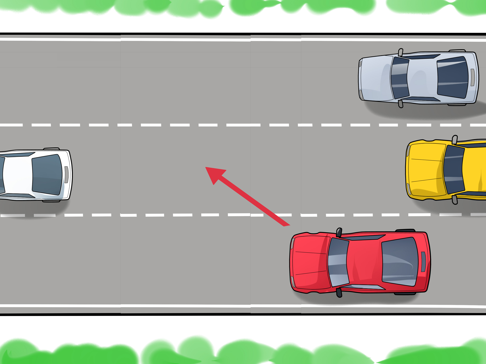

Le trafic routier est probablement l’un des plus grands fléaux du quotidien. Nous faisant perdre un temps considérable, réduisant la productivité et poussant à des comportements dangereux, les embouteillages représentent un facteur déterminant dans les accidents de la route. Alors qu’ils se produisent presque quotidiennement chaque jour sur certaines routes, et ce depuis des décennies, il serait enfin temps d’envisager une solution pour s’en débarrasser.

## Avant-propos

Ce que je vais m’efforcer de décrire au cours des prochains posts est la démarche que mon binôme (Kieran D.) et moi-même avons entrepris afin de reproduire les conditions d’un bouchon routier, puis d’étudier l’impact de la création d’une déviation sur un tel embouteillage.

Cette démarche n’est probablement pas la plus réaliste des simulations et le résultat obtenu pourrait éventuellement différer de ce que nous avons mesuré. Le but étant de se rapprocher un maximum d’un cas concret afin d’avoir une idée générale des solutions à notre disposition pour régler le problème du trafic routier.

## Comment se crée un embouteillage ?

On vient à peine de commencer à réfléchir au sujet qu’on fait déjà face à une première barrière. Comment se crée un bouchon routier ? La question a déjà été pensée, réfléchie, retournée. L’APRR (Autoroutes Paris-Rhin-Rhône) aborde la question dans [cet article](http://www.aprr.fr/fr/actualites/avec-vous-sur-la-route-comment-se-forment-les-bouchons-sur-autoroute) et définie l’embouteillage :

> La route est comme un « tuyau » qui ne peut faire passer plus d’un « flux » maximal de véhicules. À cette limite physique s’ajoute le temps de réaction des conducteurs, qui répercutent avec un léger décalage le coup de frein du conducteur qui les précède. Et redémarrent ensuite avec un nouveau temps de retard. Lorsque la circulation est dense, cela suffit à engendrer un bouchon : les temps de retard s’ajoutent les uns aux autres, aboutissant parfois à une perturbation de grande ampleur.

Expliquée autrement, il suffit qu’un conducteur adopte un mode de conduite qui sortirait de la “conduite de croisière”, en changeant de voie rapidement par exemple ou encore en ralentissant dans une ligne droite tandis qu’aucun obstacle ne lui fait face.

Source : <a href="https://www.wikihow.com/Merge-with-Heavy-Traffic" rel="roopener">Wikihow</a>

## Comment traduire ces éléments

On peut alors commencer à faire une liste des éléments à prendre en compte dans notre étude :

- les voitures ont une vitesse maximale imposée
- la voiture peut ralentir à tout moment quel que soit la route (facteur aléatoire)
- si la voiture rencontre un croisement elle peut emprunter l’un ou l’autre chemin

Ainsi que quelques hypothèses simplificatrices :

- on étudiera qu’une portion de route où la fin ramène au début de la route (cf. Tore)
- la route ne possède qu’une seule voie
- la route ne circule que dans un sens (sens unique)
- si la voiture rencontre un croisement, le choix du chemin à prendre est entièrement aléatoire
- les accidents sont inexistants et si une voiture s’arrête toutes celles qui suivent s’arrêtent en se collant à celle de devant

## Et ensuite ?

On a maintenant le principe et les concepts de base. Pour continuer dans notre démarche, le travail à été découpé en deux partie :

- un modèle informatique : simuler au plus près la circulation routière pour se rendre compte de l’impact de différents paramètres sur le trafic routier
- une maquette : pour valider ou ajuster le modèle informatique
