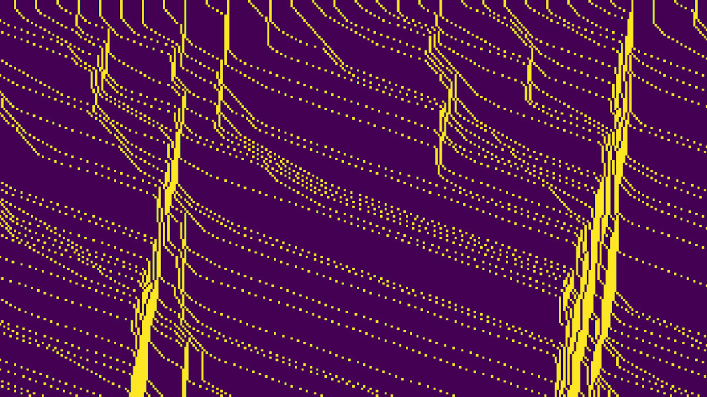

Nous allons maintenant modéliser le trafic routier pour une portion de route, en respectant les hypothèses données et décrites dans le dernier post. Pour cela on procède en 3 étapes : on crée un modèle basique à une dimension, puis on l’étend à 2 dimensions et on ajoute en dernière étape les déviations et intersections. Ce post correspond à la première phase.

La question qui m’a le plus souvent été posée lorsque je décrivais mon projet à mes camarades de classe était la suivante :

> Mais comment est-ce que tu choisis l’endroit où va se produire l’embouteillage ?

A cette question je leur réponds simplement que je ne choisis pas ! En effet, le but de cette modélisation est de faire en sorte que les voitures, par leur comportement, créent une congestion.

## Le comportement de base des voitures

En suivant l’idée du sujet de concours [CCP 2017](../../assets/posts/TIPE/PSI-Informatique.pdf) (concours d’entrée aux écoles d’ingénieur), on peut décrire le comportement des voitures simplement en décomposant un instant t en plusieurs étapes, en mettant à jour leur vitesse. Cette méthode de simulation s’appelle aussi la simulation de **Nagel et Schreckenberg**.

### Accélération

La première étape consiste à accélérer le véhicule d’une case par unité de temps. Cela correspond à une phase normale d’accélération. On limite cependant la vitesse à la vitesse maximale de la route.

$$
v*k(t + 1) \rightarrow \text{min}(v_k(t) + 1,v*\text{max})
$$

```python
def acceleration(t, k, vitesses, vmax):
    """
    Augmente l'accélération du véhicule k d'une unité
    si il n'est pas à sa vitesse maximale
    """
    vitesses[t+1][k] = min(vitesses[t][k] + 1, vmax)
```

### Décélération

La seconde étape consiste à faire ralentir le véhicule si la vitesse actuelle le fait rentrer en collision avec un autre véhicule. Pour se faire, on calcule la distance entre le véhicule et le précédent et on le compare à la vitesse actuelle. Si le véhicule est trop loin, le véhicule roule à la même vitesse, mais s’il est trop proche, le véhicule avance jusqu’à coller le véhicule devant lui, sa vitesse en sera diminuée pour simuler un freinage.

$$
v_k(t + 1) \rightarrow \text{min}(v_k(t + 1),d_k − 1)
$$

```python
def deceleration(t, k, xk, xk1, route, vitesses):
    """
    Décélère si le véhicule k ne peut pas continuer à sa vitesse
    actuelle (il y a un véhicule devant)
    """
    dk = xk1 - xk # distance entre les véhicules
    # mise à jour de la vitesse
    vitesses[t+1][k] = min(vitesses[t][k], dk - 1)
```

### Facteur aléatoire

Cette étape correspond au ralentissement aléatoire qui peut survenir en tout temps. Pour expliquer le réalisme d’une telle opération, il faut s’imaginer rouler sur une autoroute droite sans personne dessus à part un véhicule qui roule (sans régulateur de vitesse bien sûr). Alors il peut survenir un moment d’inattention qui va faire ralentir aléatoirement le conducteur.

$$
\text{Si rand()}< p \text{ alors }v_k(t + 1) \rightarrow \text{max}(v_k(t + 1) − 1,0)
$$

C’est ce phénomène qui est représenté par cette étape, il se trouve d’ailleurs que pour cette simulation, cette étape est celle qui crée les embouteillages routiers.

```python
def facteur_aleatoire(t, k, p, vitesses):
    """
    Facteur aléatoire de ralentissement (p)
    """
    if (random() < p):
        vitesses[t][k] = max(vitesses[t][k] - 1, 0)
```

### Déplacement

Cette dernière étape permet d’inscrire le mouvement lié à la vitesse de chaque véhicule. C’est à dire qu’après avoir fait la mise à jour de toutes les vitesses et en vérifiant bien qu’aucun véhicule ne rentre en collision avec d’autres, on déplace les voitures sur la route en mettant à jour leur position.

$$
X_n(t + 1) \rightarrow X_n(t) + v_n(t + 1)
$$

```python
def deplacement(t, k, xk, vitesses):
    """
    Déplace le véhicule k a sa position suivante
    """
    xk[t+1][k] = xk[t][k] + vitesses[t+1][k]
```

## Résultat

En prenant une route d’une certaine taille puis en initialisant la route avec un nombre de voitures donné, on obtient un tableau de taille *longueur x itérations* qui représentera la route et chaque ligne correspondra à un instant donné. 

On obtient un tableau de la forme :



Les conditions initiales étant :

- toutes les voitures partent à la même vitesse
- toutes les voitures partent avec une distance égale avec la précédente
- toutes les voitures possèdent le même facteur aléatoire (80% ici)

Chaque point jaune correspond à un véhicule, le reste étant la route. On se rend compte qu’avec de telles hypothèses, un bouchon se forme (sorte d’amas de points jaunes). Le code fonctionne !

Pour mieux comprendre voici une animation qui reprends chaque ligne de l’image du dessus et la fait défiler l’une après l’autre. On comprends ainsi mieux pourquoi les amas de points correspondent à un embouteillage.


La prochaine étape vue dans le prochain post sera de traduire ce code, d’utiliser le même principe et le même fonctionnement mais cette fois-ci sur une grille en 2D.
