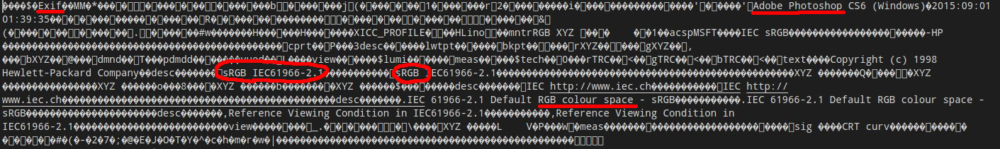
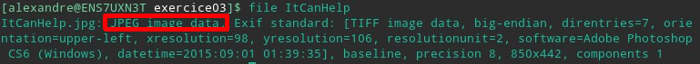
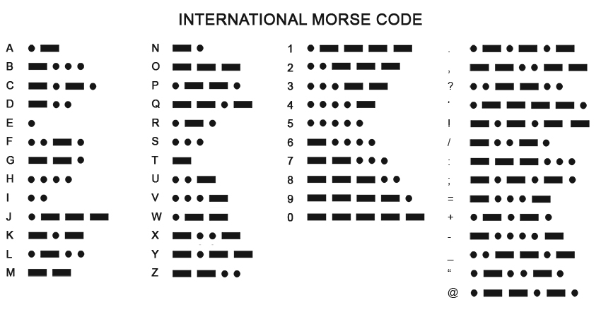
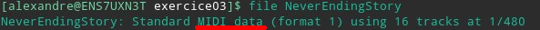
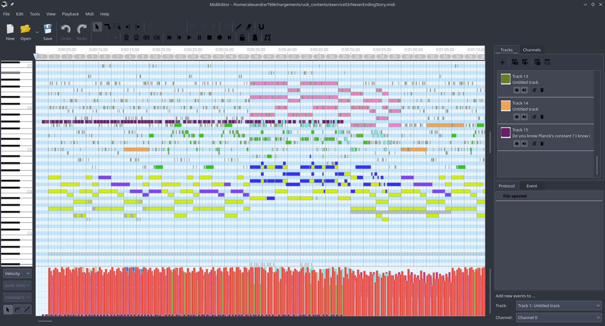
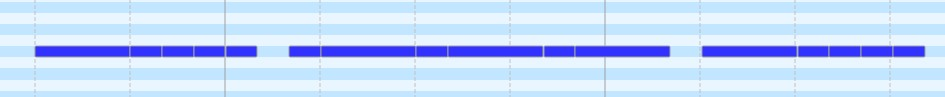

_Il semblerait qu'un fragment de clé soit caché dans cet exercice._ Je me permets de vous partager un classique revisité récemment par l'une de mes séries favorites.

-   This is Suzie, I copy.
-   Suzie!
-   Dusty-bun!?

_Look at what you see._
_But not only !_
_What is the secret of the never ending story ?_
_M. X. (-..-)_

_Faut pas chercher midi à quatorze heures mais plutôt Samuel à midi ! P.S : Samuel est un morse, choisi lui la bonne piste !_

> Le Challenge "Break the Code" est une compétition du type Capture The Flag (CTF) organisée par [Sopra Steria](https://www.soprasteria.com/fr) qui dure 1h30. Les équipes des grandes écoles du bassin brestois s’y affrontent sur des challenges informatiques. Ces challenges mélangent différentes compétences telles que la programmation, l’analyse de donnée et la culture du numérique.

## Analyse du premier fichier

L'histoire sans fin est la 3ème épreuve de ce CTF, le but étant de trouver le drapeau qui est caché dans les fichiers de l'épreuve.

> Si vous voulez essayer par vous-même, les fichiers de cet exercice sont [disponibles ici](../../assets/posts/BTC/histoire-sans-fin.zip).

On arrive sur une première difficulté. Les deux fichiers fournis ne présentant pas d'extension, c'est à nous d'en retrouver le type. Pour cela plusieurs méthodes.

La première est la lecture du code source. Pour le fichier `ItCanHelp`, une simple ouverture avec un bloc notes nous donne un indice :



La deuxième méthode est l'utilisation sous linux de la commande file :



Une troisième méthode est l'utilisation de sites web détecteurs de types de fichiers tel que [ChekFileType.com](http://www.checkfiletype.com/).

On reconnait que le fichier inconnu est une image au format JPEG. Il suffit alors j'ajouter `.jpg` au nom du fichier pour en découvrir le contenu :



On obtient le premier indice qui nous permettra de résoudre le challenge, on aura affaire à du **morse**.

## Analyse du second fichier

Avec le second fichier, certaines méthodes présentées précédemment ne pourront pas fonctionner. En effet, en essayant d'ouvrir le fichier avec un bloc note, le contenu reste illisible à l’œil nu. Pour trouver le type de fichier, la seconde comme la troisième méthode montrent qu'il s'agit d'un fichier [MIDI](https://fr.wikipedia.org/wiki/Musical_Instrument_Digital_Interface), audio donc.



Mon premier réflexe est alors de rajouter l'extension `.midi` au fichier et de l'écouter pour voir si je ne peux pas récupérer d'autres indices. (petit moment gênant du au fait que tout le monde était concentré dans son épreuve et que je joue un morceau de musique à fond sur les hauts parleurs de mon pc portable).

Malheureusement l'écoute de ce fichier ne me donne absolument aucun indice. Je repense alors au format du fichier. Le MIDI est un format qui permet de traduire assez facilement une partition en musique, je me suis alors souvenu que l'on pouvait éditer les fichiers MIDI ! L'étape suivante à donc été de télécharger un éditeur, j'ai opté pour [MIDIeditor](https://www.midieditor.org/) qui fonctionne à la fois sous Windows et Linux. L'ouverture du fichier `NeverEndingStory` me donne ceci :



On remarque deux choses fabuleuses :

1. Il existe une piste (en violet) qui a une tonalité constante
2. Il existe un canal correspondant qui porte un nom bien choisi : "Do you know Planck's constant ? I know it starts with two sixes, and then a ..."

On supprime les autres canaux, puis en zoomant sur celui qui reste on observe que le signal correspond à un code morse. Bingo !



Ci-dessous vous retrouverez la retranscription en morse (- étant un long, . étant un court)

```python
-.... .-.-.- -.... ..--- -.... ----- --... ----- ----- ....- --- .... - .... .- -. -.- ... ... ..- --.. .. . ..-. --- .-. - .... .- - .. ... - .... . -.- . -.--
```

Il suffit alors de dechiffrer le message avec un site comme [dcode.fr](https://www.dcode.fr/code-morse) qui nous retourne le flag (drapeau) suivant :

`6.62607004OHTHANKSSUZIEFORTHATISTHEKEY`

## Conclusion

Ce challenge en temps réel m'a prit près de 40 minutes à résoudre. Je n'avais pas les outils adéquats et le stress s'ajoutant, j'ai commis des erreurs qui auraient pu me faire gagner en vitesse.

Cependant ce challenge représentait à lui tout seul 55 points sur le challenge, en ajoutant les 10 points de bonus en étant la première équipe a avoir trouvé ce challenge (et finalement la seule sur les deux représentations de l'épreuve à Rennes et Brest), cela a fait près de 65 points d'un coup.

Je me suis éclaté pendant la résolution de ce challenge dont les indices étaient nombreux et j'espère qu'au travers de ces quelques lignes vous avez pu expérimenter ce même enthousiasme !
