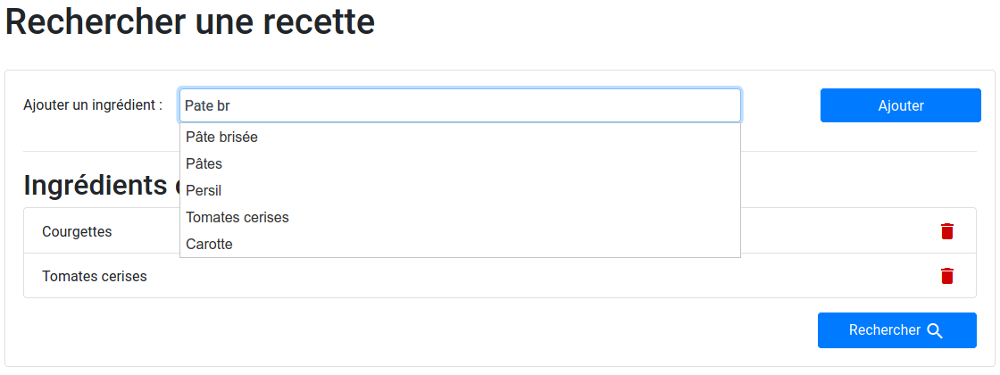

Souhaitant manger de façon plus équilibrée et ne sachant pas toujours quelle recette faire avec les ingrédients présents dans mon frigo, j'ai décidé de concevoir une application qui résout ce problème.

> L'application est disponible publiquement ici : [https://a-chef-in-the-fridge.herokuapp.com/](https://a-chef-in-the-fridge.herokuapp.com/)
> Le code source est disponible sur mon repository github : [https://github.com/NightlySide/AChefInTheFridge](https://github.com/NightlySide/AChefInTheFridge)

## Le cahier des charges

Je souhaite que cette application réponde à plusieurs besoins.

Voici la liste succincte :

- Proposer une recette en fonction des ingrédients présents dans mon frigo
- Pouvoir préparer les menus pour une semaine
  - Afficher un semainier avec la liste des recettes disponibles
  - Imprimer (en PDF) la liste de courses à faire
- Afficher les informations complémentaires sur la qualité des recettes

## Un grand livre de recettes numérique

Toute l'application se base sur des ingrédients et des recettes enregistrées par les utilisateurs. Pour les stocker, je suis tout d'abord passé par un stockage fichier en utilisant le format JSON. Cependant, après avoir déployé l'application sur la plateforme Heroku, qui recharge les fichiers à l'original dès lors que la plateforme n'est plus utilisée, les recettes sont perdues.

La solution ? Une base de données MySQL sur un autre serveur.

Ainsi, j'ai une base de données contenant une table des recettes et une table des ingrédients. L'avantage de cette structure est que les données sont accessibles depuis n'importe quelle plateforme pouvant faire des requêtes SQL, et de pouvoir plus tard implémenter la gestion des utilisateurs et des éditeurs sur la plateforme.

## Affichage des recettes

Pour pouvoir remplir le premier point de mon cahier des charges, j'ai besoin de créer une interface permettant d'ajouter les ingrédients présents dans son frigo.

L'auto-complétion est réalisée en effectuant une requête AJAX au changement du contenu de la zone d'ajout de l'ingrédient.

### Calcul du score

Le plus important avec cette application est de pouvoir trouver la recette dans laquelle il manque le moins possible d'ingrédients. Pour se faire, j'ai crée un score pour chaque recette qui dépends directement des ingrédients ajoutés par l'utilisateur.

Afin que le score soit cohérent, la recette indique la quantité nécessaire pour chaque ingrédients. par exemple pour un plat de pâtes, avoir dans son frigo les 200g nécessaire de pâtes donnera un plus grand score que juste la pincée de sel pour assaisonner le plat.

J'ai donc mis en place un système de "poids universel". Lors de l'édition d'une recette l'utilisateur est invité à choisir le type de quantité. Cette dernière est normalisée pour le calcul du poids.
