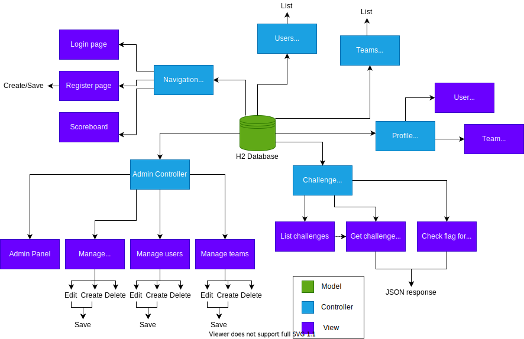
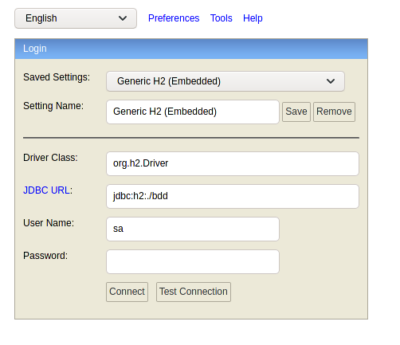
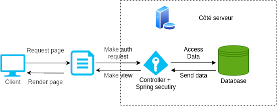

CTFa est un projet de développement web full-stack. Il s'agit d'une plateforme de gestion de challenge de type "Capture the Flag" en Jeopardy autonome et complète.

> 🚀 Le code source est disponible sur mon repository Github : [https://github.com/NightlySide/CTFa](https://github.com/NightlySide/CTFa)

## Introduction

Qu'est ce qu'un Capture the Flag ? Je pense que LiveOverflow l'explique très bien dans sa vidéo :

<iframe width="560" height="315" src="https://www.youtube.com/embed/8ev9ZX9J45A" frameborder="0" allow="accelerometer; autoplay; clipboard-write; encrypted-media; gyroscope; picture-in-picture" allowfullscreen></iframe>

**TL;DR** : un CTF en Jeopardy est une épreuve sur un temps donné où les participants tentent de résoudre des challenges. Ces challenges contiennent tous un "flag", c'est à dire un code ou un mot de passe caché qu'il faut retrouvé afin de résoudre le challenge et de gagner des points. Les challenges survolent de nombreux domaines de la cyberdéfense tels que la Cryptographie, la Stéganographie, les vulnérabilités serveurs, web, fichiers binaires, etc...

## Motivation

Le projet CTFa s'inscrit dans mes études à l'[ENSTA Bretagne](https://www.ensta-bretagne.fr/fr) en spécialisation Systèmes Numériques et Sécurité. Dans le cadre du cours sur le développement web full-stack nous avions à réaliser un site web suivant un cahier des charges assez vagues. Il devait entre autres posséder les caractéristiques suivantes :

- Une base de données permettant de stocker le contenu du site
- Un backend robuste de notre choix
- Un frontend responsive (adapté à tous les écrans) permettant d'accéder aux données et de les modifier

Ma vocation étant la cyberdéfense et ayant participé et remporté la 1ère place aux challenge [Break The Code 2019](https://www.ensta-bretagne.fr/fr/ndeg1-au-challenge-break-code-brest) et [Break The Code 2020](https://www.ensta-bretagne.fr/fr/nouvelle-victoire-au-challenge-break-code), je me suis orienté vers la création d'une plateforme permettant d'accueillir ce type d'épreuves. C'est ainsi que n'acquit CTFa : une plateforme de gestion de CTF.

M'étant beaucoup inspiré des fonctionnalités du projet open source [CTFd](https://github.com/CTFd/CTFd) j'ai souhaité faire un clin d’œil en lui donnant un nom similaire.

## La structure du projet

Pour suivre le cahier des charges imposées par le cours, il m'a fallut choisir une structure [MVC](https://en.wikipedia.org/wiki/Model%E2%80%93view%E2%80%93controller) (Model View Controller) qui permet de séparer les données du rendu des pages web.

J'ai essayé de reproduire la structure MVC du projet avec le schéma suivant :

### La base de donnée

Concernant la base de données plusieurs technologies sont à ma disposition. Si je pars sur les plus populaires on peut parler de MySQL, SQLite ou encore MongoDB. Cependant ce projet était l'occasion pour moi d'essayer une technologie différente. 

Réalisant le backend en Java, mon choix s'est orienté sur [H2](https://www.h2database.com/html/main.html) qui a pour avantage de pouvoir se charger entièrement dans la mémoire RAM du système l’exécutant, mais surtout qui est très bien intégré à un projet Java/Maven et qui m'a permit de tout assembler dans un fichier .jar unique.

Cette base de donnée nous fournit une console d'accès à l’adresse suivante : http://localhost:9090/h2.

### Le backend

Ayant l'habitude de coder en Python et plus particulièrement avec [Flask](https://flask.palletsprojects.com/en/1.1.x/) pour le backend, je voulais sortir de ma zone de confort. Java étant encore très répandu dans les entreprises, mon choix s'est naturellement porté vers ce langage de programmation.

L'un des framework les plus matures en Java est [Spring](https://spring.io/). Pour prendre en charge certaines configurations j'ai construit mon backend avec Spring Boot :

Pour gérer les droits d'accès aux modifications des informations de la base de données il m'a suffit d'utiliser Spring Security qui s'intègre très bien et qui nous permet de contrôler le flux des données comme expliqué sur le schéma suivant :

### Le frontend

Le but de ce projet était de fournir autant de temps sur chacune des parties qui compose un projet full-stack. Pour éviter de passer trop de temps sur le frontend j'ai choisi une bibliothèque graphique très populaire : [Bootstrap](https://getbootstrap.com/).

Cette bibliothèque apporte son lot d'avantages comme des composants prêts à l’emploi ou encore une structure responsive qui s'adapte à la taille d'écran sur laquelle on regarde le site. Cependant elle apporte aussi son lot d'inconvénients notamment son poids qui est non négligeable.

## Conclusion

Ce projet m'a appris beaucoup de choses sur la conception d'un système complet et surtout sur la rigueur et la discipline nécessaire pour mener un tel projet à bout. Pour des projets aussi gros il devient nécessaire de poser à plat les exigences et le cahier des charges.

Avec du recul, je pense qu'il y a certains points que j'aurais pu améliorer sur ce projet comme le choix d'une meilleure technologie pour le frontend comme [ReactJS](https://fr.reactjs.org/) par exemple. Aussi je devrais mieux définir mes objectifs pour ne pas me perdre lors de la réalisation du projet.